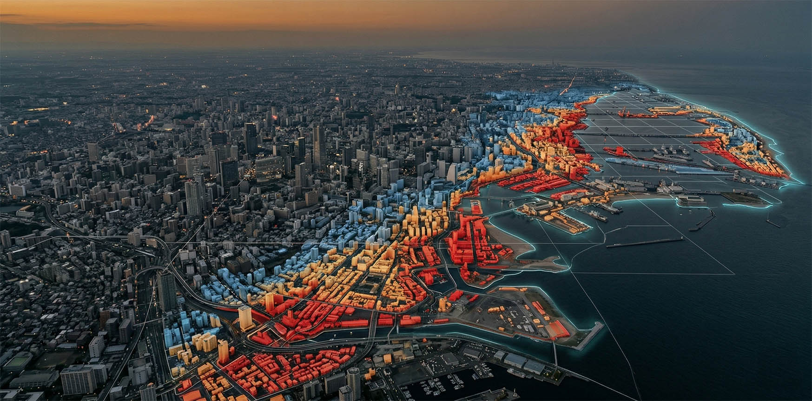
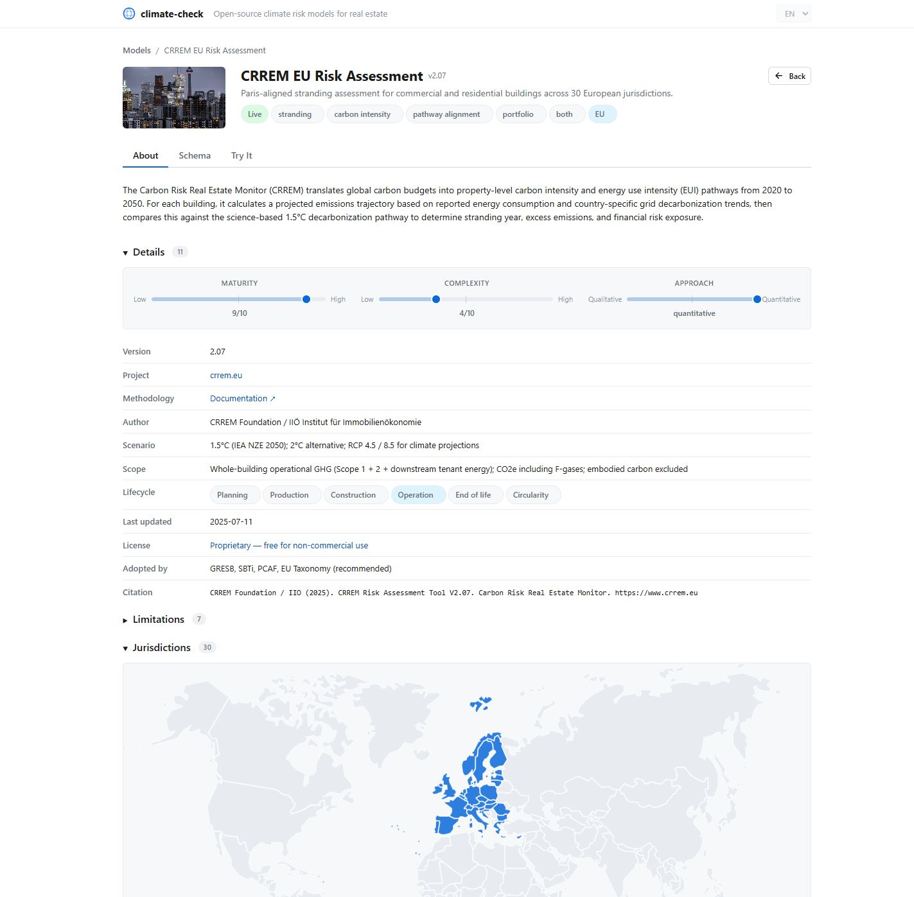

# climate-check

[](https://github.com/davras5/climate-check)
[](https://github.com/davras5/climate-check)
[](LICENSE)
[](https://github.com/davras5/climate-check)

**A curated collection of climate risk models for real estate.** Browse 109 models across transition risk, physical risk, carbon accounting, energy performance, embodied carbon, and more. For 22 of them we provide a harmonized API wrapper so you can chain queries across engines.


---

## Key Features

- **109 models** with verified metadata — author, license, scope, limitations, citations
- **22 live engines** with a harmonized API: upload CSV, get results, chain queries across models
- **Interactive Try It tab**: drop a CSV, see a real-time processing console, download results
- **4 views**: gallery cards, sortable list, interactive world map, complexity/maturity scatter plot
- **Filtering**: category, lifecycle phase, license, region, status, tags — all URL-synced and shareable
- **Zero dependencies**: vanilla JS, no build step, runs from a static file server



---

## Models by Category

| Category | Count | Examples |
|----------|-------|---------|
| Energy Performance | 14 | ENERGY STAR, NABERS, ASHRAE BEQ, Sonnendach.ch |
| Physical Risk | 11 | CLIMADA, OpenQuake, SFINCS, JRC Flood Maps |
| Carbon Accounting | 6 | PCAF, BAFU CO2, KBOB LCA, Mobitool |
| Embodied Carbon | 6 | EC3, eLCA, Madaster, EU Level(s) |
| Transition Risk | 5 | CRREM (EU/NA/APAC), SBTi, PACTA CH |
| Multi-Criteria | 4 | DGNB, BREEAM, SNBS, SSREI |
| Grid Optimization | 3 | REopt, FlexMeasures, DER-VET |
| Target Setting | 2 | SBTi, Climate Bonds |
| Indoor Environment | 1 | CBE Thermal Comfort Tool |

### Swiss Coverage (14 models)

Deep coverage for Switzerland including: BAFU CO2 Calculator, SNBS Hochbau, geo.admin.ch Hazard Layers, Cantonal Hazard Maps, ERM-CH23 Earthquake Risk, Sonnendach.ch, NCCS CH2025 Climate Scenarios, Schutz vor Naturgefahren, KBOB Okobilanzdaten, PACTA CH, SSREI, Madaster CH, Mobitool.

---

## Tech Stack

| Layer | Technology |
|-------|-----------|
| Frontend | Vanilla JS (no framework, no build step) |
| Styling | Custom CSS with design tokens (`tokens.css` + `style.css`) |
| Charts | Chart.js 4.4.7 + chartjs-plugin-zoom |
| Database | SQLite in the browser via sql.js |
| Maps | Inline SVG world map (CC BY-SA 3.0) |
| Icons | Lucide (inline SVG, no CDN) |
| Data | SQLite (`data/models.db`) |

### Project Structure

```
climate-check/
  index.html                  Single-page app shell
  css/
    tokens.css                Design tokens (colors, spacing, fonts)
    style.css                 All component styles
  js/
    app.js                    Main application
  engines/
    {id}/
      engine.js               Harmonized API wrapper
      test.csv                Demo input data
      README.md               Engine documentation
  data/
    models.db                 Model metadata (SQLite)
  assets/
    world-map.svg             Interactive world map
    img/                      Model card images
  docs/
    models.sql                Database schema
```

---

## Harmonized Engine API

Each engine exposes the same interface:

```javascript
await engine.init();                          // Load reference data
const result = await engine.calculate(row);   // Process one row
const rows   = engine.parseCSV(csvText);      // Parse CSV input
const csv    = engine.generateTemplate();     // Get CSV template (optional)
const errors = engine.validate(row);          // Validate input (optional)
```

Upload a CSV in the **Try It** tab, watch the processing console, and download results as CSV. Engines that call external APIs (BAFU CO2, geo.admin.ch, etc.) run async; local engines (CRREM) run instantly.

---

## Roadmap

- More live engines (CRREM NA/APAC, CBE Thermal Comfort, pyBuildingEnergy)
- REST API (`/api/v1/calculate/{id}`, `/api/v1/models`)
- Swiss geo-API integration (flood zones, earthquake zones, solar potential, GWR)
- EU Taxonomy screening calculator
- Climate-adjusted property valuation

---

## Contributing

1. Fork the repository
2. Add a model to `data/models.db` following the schema in [docs/models.sql](docs/models.sql)
3. For live engines, add an `engines/{id}/engine.js` implementing the harmonized API
4. Submit a pull request

---

## License

MIT License. See [LICENSE](LICENSE).

Model metadata is compiled from public sources. Individual models have their own licenses (see the `license` field per model).

World map SVG: [CC BY-SA 3.0](https://github.com/flekschas/simple-world-map) by Al MacDonald, edited by Fritz Lekschas. Card images sourced from [Unsplash](https://unsplash.com) (free license).
