# CRREM Risk Assessment Model

## What is CRREM?

The **Carbon Risk Real Estate Monitor (CRREM)** is a science-based framework that assesses whether commercial and residential buildings are aligned with the decarbonization targets of the Paris Agreement. It translates global carbon budgets into property-level carbon intensity and energy use intensity (EUI) pathways from 2020 to 2050, and identifies the year at which a given building's emissions exceed its allowable budget (its "stranding year").

CRREM is maintained by the CRREM Foundation and the Institut fur Immobilienokonomie (IIO) in Austria, with contributions from the University of Ulster, GRESB, the University of Alicante, Tilburg University, and (for North America) Lawrence Berkeley National Laboratory (LBNL).

The Risk Assessment Tool is distributed as an Excel workbook in three regional editions: EU, Asia-Pacific, and North America. This document describes version **V2.07** (dated 11 July 2025). The Reference Guide PDF documents V2.05 (February 2025); differences are noted where applicable.

---

## Conceptual Data Model

### Entity Relationship Diagram

```mermaid
erDiagram
    GlobalCarbonBudget {
        float total_co2_gt "468 Gt CO2 (IEA NZE, 2020-2050)"
        float total_co2e_gt "759 Gt CO2e (IPCC AR6, 2020-2050)"
        float real_estate_share_pct "~19.49%"
        float buildings_budget_co2_gt "~91 Gt CO2"
        float buildings_budget_co2e_gt "~102 Gt CO2e"
    }

    Jurisdiction {
        string id "country or sub-region code"
        string name
        string region "EU, APAC, or North America"
        float population_2020
        float hdd "heating degree days"
        float cdd "cooling degree days"
        float baseline_carbon_intensity "2020 observed kgCO2/m2"
        float baseline_floor_area_m2 "2020 building stock"
    }

    PropertyType {
        string id
        string name "e.g. Office, Hotel"
        string edition "EU/APAC, NA, or both"
        string sector "residential or commercial"
        float energy_intensity_factor "ratio to sector average"
    }

    CarbonPathway {
        string jurisdiction_id FK
        string property_type_id FK
        string scenario "1.5C or 2C"
        float[] annual_intensity "kgCO2e/m2 for 2020-2050"
    }

    EUIPathway {
        string jurisdiction_id FK
        string property_type_id FK
        string scenario "1.5C or 2C"
        float[] annual_intensity "kWh/m2 for 2020-2050"
        int levelling_year "year pathway flattens (can be as early as 2030)"
        float net_zero_eui_target "kWh/m2 at and after levelling year"
    }

    EnergySource {
        string id "electricity, natural_gas, fuel_oil, etc."
        string name
        float static_emission_factor "kgCO2e/kWh (for fuels)"
    }

    GridEmissionFactor {
        string jurisdiction_id FK
        int year
        float emission_factor "kgCO2e/kWh"
    }

    EnergyMix {
        string jurisdiction_id FK
        string property_type_id FK
        int year
        float electricity_share
        float gas_share
        float oil_share
        float district_heating_share
        float other_share
    }

    WeightedEmissionFactor {
        string jurisdiction_id FK
        string property_type_id FK
        int year
        float weighted_ef "kgCO2e/kWh (derived)"
    }

    ClimateProjection {
        string jurisdiction_id FK
        string scenario "RCP4.5 or RCP8.5"
        int year
        float projected_hdd
        float projected_cdd
    }

    FloorAreaProjection {
        string jurisdiction_id FK
        int year
        float projected_floor_area_m2
        float market_share_param "m(y), capped at 1"
    }

    CarbonPriceSchedule {
        int year
        float price_per_tonne "EUR (EU) or USD (NA/APAC)"
    }

    EnergyPriceDefaults {
        string jurisdiction_id FK
        string energy_source_id FK
        float price_per_kwh
        float annual_escalation_pct
    }

    RetrofitCostFactors {
        string jurisdiction_id FK
        float construction_cost_index
    }

    PostalCodeLookup {
        string postal_code
        string jurisdiction_id FK
        string sub_region
        float local_hdd
        float local_cdd
    }

    RefrigerantType {
        string name "e.g. R-410A, R-134a"
        float gwp "global warming potential"
    }

    Portfolio {
        string id
        string name
    }

    Asset {
        string id
        string name
        string portfolio_id FK
        string jurisdiction_id FK
        string property_type_id FK
        string entity "fund or entity name"
        int reporting_year "2020-2024"
        int reporting_start_month
        int reporting_period_months
        float gross_internal_area_m2
        float vacant_area_m2
        float gross_asset_value "EUR or USD by edition"
        float ownership_pct "partial ownership allocation"
        string postal_code
        bool air_conditioning
        bool include "include/exclude toggle"
    }

    EnergyConsumption {
        string asset_id FK
        string energy_source_id FK
        float consumption_kwh
        float data_coverage_m2
        float max_coverage_m2
    }

    RenewableGeneration {
        string asset_id FK
        float consumed_onsite_kwh "all on-site sources combined"
        float exported_kwh "all on-site sources combined"
        float offsite_purchased_kwh
        string accounting_method "location or market-based"
    }

    FugitiveEmission {
        string asset_id FK
        string refrigerant_type_id FK
        float annual_leakage_kg
    }

    RetrofitScenario {
        string asset_id FK
        int sequence "1, 2, or 3 (up to 3 per asset)"
        int retrofit_year
        float investment "EUR or USD by edition"
        float energy_reduction_pct
        float embodied_carbon_kgco2e
    }

    AssetSettings {
        string asset_id FK
        bool normalize_occupancy "default true"
        bool normalize_hdd_cdd "default true"
        string climate_scenario "RCP4.5 or RCP8.5"
        float discount_rate "default 0.03"
        float[] custom_elec_ef "optional override 2020-2050"
        float[] custom_dh_ef "optional DH override 2020-2050"
        float[] custom_dc_ef "optional DC override 2020-2050"
        float[] custom_pathway "optional kgCO2e/m2 2020-2050"
    }

    StrandingAssessment {
        string asset_id FK
        string scenario "1.5C, 2C, or user-defined"
        float baseline_carbon_intensity "kgCO2e/m2"
        float baseline_eui "kWh/m2"
        float[] projected_intensity "kgCO2e/m2, 2020-2050"
        int stranding_year "or null if aligned"
        float excess_emissions_total "kgCO2e cumulative"
        float excess_emissions_per_m2
        float cvar_pct "Carbon Value at Risk as % of GAV"
        float annual_energy_cost
        float total_ghg_emissions_kg
    }

    RetrofitAssessment {
        string asset_id FK
        int sequence "1, 2, or 3"
        int new_stranding_year "after retrofit"
        float cost_to_comply
        float economic_payback_years
        float ecological_payback_years
    }

    PortfolioAssessment {
        string portfolio_id FK
        string scenario "1.5C, 2C, or user-defined"
        float[] stranded_share_by_year "% of portfolio stranded"
        float[] portfolio_ghg_intensity "kgCO2e/m2 per year"
        float[] portfolio_excess_costs "per year"
        float portfolio_cvar_pct
    }

    %% --- Pathway construction relationships ---
    GlobalCarbonBudget ||--o{ CarbonPathway : "downscaled into"
    Jurisdiction ||--o{ CarbonPathway : "has"
    PropertyType ||--o{ CarbonPathway : "has"
    CarbonPathway ||--|| EUIPathway : "converted to via WeightedEF"

    Jurisdiction ||--o{ GridEmissionFactor : "has yearly"
    Jurisdiction ||--o{ EnergyMix : "has yearly"
    PropertyType ||--o{ EnergyMix : "varies by"
    Jurisdiction ||--o{ FloorAreaProjection : "has yearly"
    Jurisdiction ||--o{ ClimateProjection : "has yearly"
    Jurisdiction ||--o{ EnergyPriceDefaults : "has"
    Jurisdiction ||--o{ RetrofitCostFactors : "has"
    Jurisdiction ||--o{ PostalCodeLookup : "contains"

    EnergyMix }o--|| EnergySource : "shares of"
    GridEmissionFactor }o--|| EnergySource : "for electricity"
    EnergyMix ||--|| WeightedEmissionFactor : "combined into"
    GridEmissionFactor ||--|| WeightedEmissionFactor : "combined into"
    WeightedEmissionFactor ||--|| EUIPathway : "used to derive"

    %% --- Asset-level relationships ---
    Portfolio ||--o{ Asset : "contains"
    Jurisdiction ||--o{ Asset : "located in"
    PropertyType ||--o{ Asset : "classified as"
    Asset ||--o{ EnergyConsumption : "reports"
    EnergySource ||--o{ EnergyConsumption : "type of"
    Asset ||--|| RenewableGeneration : "reports"
    Asset ||--o{ FugitiveEmission : "reports"
    RefrigerantType ||--o{ FugitiveEmission : "type of"
    Asset ||--o{ RetrofitScenario : "may have up to 3"
    Asset ||--|| AssetSettings : "configured by"

    %% --- Assessment output relationships ---
    Asset ||--o{ StrandingAssessment : "produces"
    CarbonPathway ||--o{ StrandingAssessment : "compared against"
    EUIPathway ||--o{ StrandingAssessment : "compared against"
    CarbonPriceSchedule ||--o{ StrandingAssessment : "costs priced by"
    RetrofitScenario ||--o| RetrofitAssessment : "produces"
    Portfolio ||--o{ PortfolioAssessment : "produces"
```

### Entity Overview

| Entity | Domain | Description |
|---|---|---|
| **GlobalCarbonBudget** | Pathway | The IEA/IPCC remaining carbon budget for 2020-2050, allocated to the buildings sector (~19.49%). The IEA NZE CO2-only budget is 468 Gt (vs. IPCC's 500 Gt CO2-only, the difference accounting for energy-related non-CO2 GHGs). The CO2e budget is 759 Gt (IPCC AR6, 50% likelihood). Buildings sector allocation: ~91 Gt CO2 / ~102 Gt CO2e. The 2C scenario budget is 1,191 Gt CO2e. Global starting intensity in 2020: 34.9 kgCO2/m2 (CO2-only) / 37.4 kgCO2e/m2. Global 2050 targets: 0.38 kgCO2/m2 / 0.63 kgCO2e/m2. |
| **Jurisdiction** | Pathway | A country or sub-national region (e.g., "Germany", "Arizona-New Mexico", "Ontario"). Carries baseline 2020 carbon intensity, population, and HDD/CDD. 41 countries in V2.07 (see Jurisdictions section), plus sub-regions in the US (57) and Canada (11). |
| **PropertyType** | Pathway | A building use classification. Varies by edition: EU/APAC has 11 types, NA has 16 types (see Property Types section). Each type has an energy-intensity adjustment factor relative to its sector (residential or commercial) average. |
| **CarbonPathway** | Pathway | The annual maximum allowable carbon intensity (kgCO2e/m2) for a given jurisdiction + property type + warming scenario, from 2020 to 2050. Produced by applying the SDA convergence formula: `CI(y) = SI_2050 + (CI_b - SI_2050) * p(y) * m(y)`. |
| **EUIPathway** | Pathway | The annual maximum allowable energy use intensity (kWh/m2) for a given jurisdiction + property type + scenario. Derived by dividing the CarbonPathway by the WeightedEmissionFactor for each year. Includes a levelling year and a net zero EUI target. If the implied annual reduction falls below 3%, a minimum 2.9% annual reduction rate is enforced thereafter (UN SDG 7.3). Levelling years can be as early as 2030 in jurisdictions with slow grid decarbonization. |
| **EnergySource** | Reference | A type of energy consumed by buildings: grid electricity, natural gas, fuel oil, district heating (steam), district cooling, biogas, wood chips, wood pellets, coal, landfill gas, LPG. Fuels carry static emission factors; grid electricity and district heating have projected factors. Note: hot water district heating should be reported under "Other", not district heating. |
| **GridEmissionFactor** | Reference | The projected carbon intensity of grid-supplied electricity (kgCO2e/kWh) for a jurisdiction in a given year. Declines over time as grids decarbonize. Sources: EC Fit for 55 + EU Reference Scenario (EU), eGRID historical + Cambium projections with linear interpolation for 2022-2034 (US), ECCC (Canada), carbonfootprint.com + IEA NZE (others). Alaska and Hawaii use national Cambium shape applied to local starting values. |
| **EnergyMix** | Reference | The projected shares of each energy source used by buildings in a jurisdiction, broken down by property type and year. Reflects trends in electrification, fuel switching, and district heating. Note: Canada uses sector-level (residential vs. commercial) weighted emission factors rather than property-type-level factors. |
| **WeightedEmissionFactor** | Derived | The building-stock weighted average emission factor (kgCO2e/kWh) for a jurisdiction + property type + year. Computed as: `sum(EF_source * share_source)` across all energy sources. This is the bridge between carbon and energy pathways. |
| **FloorAreaProjection** | Reference | Projected total building floor area for a jurisdiction by year. Global floor area is projected to grow ~75% from 2020 to 2050 (~2.44 bn m2 to ~4.27 bn m2). Used to compute the market share parameter `m(y)` in the SDA formula. |
| **ClimateProjection** | Reference | Projected future HDD and CDD for a jurisdiction under RCP4.5 or RCP8.5, by year. Used to adjust the building's projected energy demand trajectory. |
| **CarbonPriceSchedule** | Reference | Projected carbon price per tonne by year. Default: 32 EUR/t in 2023 rising to 250 EUR/t in 2050 (BloombergNEF/SBTi). User-overridable with custom initial price, climax price, growth type, and rate. Note: V2.07 Settings sheet shows configurable example values that may differ from the documented defaults. |
| **EnergyPriceDefaults** | Reference | Default energy price per kWh and annual escalation rate for each energy source in a jurisdiction. Sources: Eurostat (EU), market data. |
| **RetrofitCostFactors** | Reference | Country-specific construction cost indices and abatement cost curves for estimating retrofit costs. Sources: ECC European Construction Costs, DEEP database. |
| **PostalCodeLookup** | Reference | Maps postal/ZIP codes to sub-national regions and local HDD/CDD values. ~363,000 entries in the EU edition; ~39,300 entries in the NA edition. Enables climate corrections at the building level. |
| **RefrigerantType** | Reference | Refrigerant gases (R-410A, R-134a, etc.) with their Global Warming Potential (GWP). 40+ refrigerant types available. Used to convert refrigerant leakage to CO2e. Reporting F-gases switches the assessment to a CO2e pathway. |
| **Portfolio** | Input | A named collection of assets, typically representing a fund or entity. |
| **Asset** | Input | An individual building. Carries location, property type, floor area, vacancy, GAV, ownership %, and reporting period. Includes an include/exclude toggle for portfolio-level analysis. The central input entity. |
| **EnergyConsumption** | Input | Reported energy usage per energy source for an asset: consumption in kWh, data coverage area, and maximum coverage area (enabling extrapolation for partial metering). EV charging station electricity and parking areas must be excluded. |
| **RenewableGeneration** | Input | On-site renewable energy: consumed on-site vs. exported to grid, plus off-site renewable purchases with accounting method selection (location-based recommended). The tool collects three aggregate fields, not broken down by solar/wind/other. On-site consumed energy gets an emission factor of zero. |
| **FugitiveEmission** | Input | Reported annual refrigerant leakage per asset, by refrigerant type and amount in kg. Converted to CO2e using GWP factors. Up to 2 refrigerant types per asset. |
| **RetrofitScenario** | Input | An optional future retrofit action for an asset: year, investment cost, expected energy reduction %, and embodied carbon. Up to **3 retrofit scenarios per asset** (RF1, RF2, RF3). |
| **AssetSettings** | Input | Per-asset configuration overrides: occupancy normalization, HDD/CDD normalization, climate scenario, discount rate, custom emission factor schedules (electricity, district heating, district cooling), and custom decarbonization pathways. |
| **StrandingAssessment** | Output | The core output per asset per scenario. Contains baseline carbon and energy intensity, the projected intensity trajectory (2020-2050), stranding year, cumulative excess emissions, CVaR, and annual cost projections. Produced by comparing the asset's trajectory against its CarbonPathway and EUIPathway. |
| **RetrofitAssessment** | Output | Output from applying a RetrofitScenario: revised stranding year, cost to comply, economic payback period (investment vs. discounted energy savings), and ecological payback period (embodied carbon vs. operational savings). One per retrofit scenario. |
| **PortfolioAssessment** | Output | Aggregated output across all assets in a portfolio: evolution of stranding share over time, floor-area-weighted GHG intensity, aggregate excess emission costs, and portfolio CVaR. Supports filtering by jurisdiction, property type, entity, and simulated asset sales. |

### How the Entities Connect: Calculation Flow

1. **GlobalCarbonBudget** is downscaled via the SDA formula using **FloorAreaProjection** to produce a **CarbonPathway** for each **Jurisdiction** x **PropertyType** combination.
2. **GridEmissionFactor** and **EnergyMix** (per jurisdiction, property type, and year) are combined into a **WeightedEmissionFactor**.
3. **CarbonPathway** / **WeightedEmissionFactor** = **EUIPathway**, subject to a floor: if the implied annual reduction falls below 3%, a minimum 2.9% annual reduction rate is enforced thereafter (UN SDG 7.3). The EUI pathway levels off at a net zero EUI target derived from jurisdiction population, HDD/CDD, and property type energy-intensity factors.
4. An **Asset** reports **EnergyConsumption**, **RenewableGeneration**, and **FugitiveEmission**. These are converted to a baseline carbon intensity using emission factors from **EnergySource** and **GridEmissionFactor**. Users must normalize for operating hours before data entry (e.g., 24/7 buildings vs. standard 8-hour offices). EV charging and parking area energy must be excluded.
5. The asset's future trajectory is projected using **GridEmissionFactor** trends and **ClimateProjection** (future HDD/CDD).
6. The trajectory is compared against the **CarbonPathway** and **EUIPathway** to produce a **StrandingAssessment**: stranding year, excess emissions, and CVaR (priced via **CarbonPriceSchedule**).
7. If **RetrofitScenarios** are defined (up to 3), the trajectory is recalculated to produce a **RetrofitAssessment** for each.
8. All asset-level **StrandingAssessments** within a **Portfolio** are aggregated into a **PortfolioAssessment**.

---

## Reference Data

The following static reference datasets are embedded in the tool's backend sheets and are required to perform the calculations.

### Carbon Pathway Data

| Dataset | Description | Dimensions | Source |
|---|---|---|---|
| Global carbon budget | Remaining CO2/CO2e budget for buildings 2020-2050: 91 Gt CO2 (1.5C) / 102 Gt CO2e (1.5C) | Scalar | IPCC AR6, IEA NZE 2021 |
| Global decarbonization index (p) | Year-by-year fraction of remaining decarbonization (1 in 2020, 0 in 2050) | 31 values (2020-2050) | Derived from IEA NZE |
| Jurisdiction baseline carbon intensities | 2020 observed kgCO2/m2 per jurisdiction and property type | ~41 countries x 11-16 property types | National statistics, GRESB, data partners |
| Building stock floor area | Existing and projected floor area per jurisdiction (~75% growth 2020-2050) | ~41 countries x 31 years | IEA, UN, national statistics |
| Market share parameters (m) | Relative building stock growth rates per jurisdiction | ~41 countries x 31 years | Derived from floor area projections |

### Emissions Factors

| Dataset | Description | Dimensions | Source |
|---|---|---|---|
| Grid electricity emission factors | kgCO2e/kWh per jurisdiction, projected 2020-2050 | ~41 jurisdictions x 31 years | EU: EC Fit for 55 + EU Reference Scenario; US: eGRID (historical) + Cambium (projected, linearly interpolated 2022-2034); Canada: ECCC; Others: carbonfootprint.com, IEA NZE |
| District heating emission factors | kgCO2e/kWh per jurisdiction, projected 2020-2050 | Per jurisdiction x 31 years | IEA, coupled to electricity EF via ratio |
| Fuel emission factors | kgCO2e/kWh for natural gas, fuel oil, coal, LPG, biomass, etc. | Per fuel type (static) | UK Gov BEIS 2020. Note: natural gas EF = 0.18316 (EU/APAC) or 0.18105 (NA) kgCO2e/kWh |
| Refrigerant GWP factors | Global Warming Potential per refrigerant type (40+ types) | Per refrigerant | IPCC |
| Building-stock energy mix | Projected shares of electricity, gas, oil, DH per jurisdiction and property type, 2020-2050 | ~41 jurisdictions x 11-16 property types x 31 years | EU: EC Reference Scenario; US: CBECS 2018/RECS 2020 + IEA ETP 2017; Canada: Canada Energy Future 2023 |

### Energy and Climate Data

| Dataset | Description | Dimensions | Source |
|---|---|---|---|
| Baseline EUI by jurisdiction and property type | 2020 observed kWh/m2 starting values | ~41 jurisdictions x 11-16 property types | EU: Eurostat, national surveys, GRESB; US: CBECS 2018, RECS 2020, Fannie Mae survey, ENERGY STAR reverse scoring, ICSC; Canada: SCIEU 2019, SHEU 2019, NEUD 2020, ENERGY STAR reverse scoring |
| 2050 Net Zero EUI targets | kWh/m2 energy target per jurisdiction and property type | ~41 jurisdictions x 11-16 property types | Derived from IEA NZE via jurisdiction population, HDD/CDD, and property type factors |
| Heating degree days (HDD) | Annual HDD per jurisdiction | ~41 jurisdictions (+ sub-regions) | Eurostat 2020, IEA Weather Tracker, TMY3 (US) |
| Cooling degree days (CDD) | Annual CDD per jurisdiction | ~41 jurisdictions (+ sub-regions) | Same as HDD |
| Projected HDD/CDD under climate change | Future HDD/CDD per jurisdiction under RCP4.5 and RCP8.5 | Per jurisdiction x 31 years | Spinoni et al. (2018), Eurostat |
| Property type adjustment factors | Ratio of each sub-type's energy intensity to sector average | 11-16 property types | CRREM data partners, GRESB (30,000+ properties) |

### Financial Reference Data

| Dataset | Description | Source |
|---|---|---|
| Carbon price projections | EUR/tCO2 from 2023 (~32 EUR/t) to 2050 (~250 EUR/t), per Reference Guide V2 defaults | BloombergNEF 2022, SBTi scenario |
| Energy prices by jurisdiction | Price per kWh for electricity, gas, oil, DH, by country | Eurostat (EU), market data |
| Retrofit cost factors | Country-specific construction cost indices | ECC European Construction Costs, RLB Euro Alliance |
| Retrofit abatement cost curves | Energy reduction achievable per unit investment | DEEP database (EU) |
| Discount rate | Default 3% for NPV calculations | BPIE |

### Geographic Lookup Data

| Dataset | Description | Rows | Source |
|---|---|---|---|
| Postal code to NUTS/climate region mapping | Maps postal codes to sub-national regions for HDD/CDD lookup | ~363,000 (EU edition) | National postal authorities |
| US ZIP code to eGRID region x CBECS climate zone | Maps ZIP codes to 57 US sub-regions | ~39,300 | LBNL (eGRID, CBECS, ASHRAE) |
| Canadian postal codes to province | Maps to 11 Canadian sub-regions | Variable | Statistics Canada |

Note: The APAC edition reuses the EU postal code database internally, with APAC countries mapped to EU country code slots (e.g., Australia = LV, Japan = DE). This is an implementation detail of the Excel tool.

---

## Input Fields

### Per-Asset Required Inputs

| Field | Format | Description | Notes |
|---|---|---|---|
| Asset Name | Text | Identifier for the building | |
| Reporting Year | Selection | Year of the energy data | 2020, 2021, 2022, 2023, or 2024 (V2.06+ added 2023-2024) |
| Country | Selection | Jurisdiction where the building is located | 30 (EU), 9 (APAC), 2 (NA) — see Jurisdictions |
| Property Type | Selection | Building use classification | 11 types (EU/APAC), 16 types (NA) — see Property Types |
| Total Gross Internal Area | Numeric (m2) | Floor area measured to IPMS 2 standard | Exclude outdoor/exterior areas and indoor parking (heated or non-heated). Switzerland: multiply EBF by 0.9. Hong Kong residential: multiply Leasable Area by 1.15. |
| Average Annual Vacant Area | Numeric (m2) | Unoccupied floor area | Used for occupancy normalization |

### Per-Asset Optional Inputs

| Field | Format | Description | Notes |
|---|---|---|---|
| Gross Asset Value (GAV) | Numeric (EUR or USD) | Market value of the asset | Required for Carbon Value at Risk (CVaR) calculation. Currency depends on edition. |
| % Ownership | Numeric (%) | Partial ownership allocation | Allocates proportional share of emissions |
| Reporting Period Start Month | Selection (1-12) | Month the energy reporting period begins | |
| Reporting Period Length | Numeric (months) | Duration of energy data (1-12) | Default assumes annualized |
| Entity / Fund Name | Text | Portfolio grouping identifier | For portfolio-level filtering |
| City | Text | City location | |
| ZIP / Postal Code | Text | Postal code | Enables local HDD/CDD climate corrections and (in NA) automatic pathway assignment |
| Address | Text | Full street address | |
| Air Conditioning | Yes/No | Whether the building has AC | Affects energy projections |
| Include / Exclude | Selection | Toggle asset in/out of portfolio analysis | |

### Energy Consumption (per energy source)

For each energy source, three values are collected: consumption (kWh), data coverage area (m2), and maximum coverage area (m2). The data coverage fields enable extrapolation when metering covers only part of the building.

Users must normalize for operating hours before data entry (e.g., 24/7 buildings vs. standard 8-hour offices). EV charging station electricity must be excluded. Parking areas should be excluded from floor area measurements.

| Energy Source | Emission Factor Basis | Notes |
|---|---|---|
| Grid Electricity | Jurisdiction-specific grid EF (projected annually) | |
| Natural Gas | Static fuel EF: 0.18316 kgCO2e/kWh (EU/APAC) or 0.18105 kgCO2e/kWh (NA) | Source: UK Gov BEIS 2020 |
| Fuel Oil | Static fuel EF | |
| District Heating (steam) | Coupled to electricity EF via ratio | Hot water DH should be reported under "Other" |
| District Cooling | Coupled to electricity EF via ratio | |
| Other Source 1 | Per-fuel static EF | Biogas, wood chips, wood pellets, coal, landfill gas, LPG |
| Other Source 2 | Per-fuel static EF | Second alternative fuel source |

### Renewable Energy Generation

The tool collects three aggregate fields (not broken down by solar/wind/other):

| Field | Format | Description |
|---|---|---|
| On-site generated and consumed on-site | Numeric (kWh) | All on-site renewable energy used on-site (solar PV, wind, geothermal, hydro, etc.). Added to total energy consumption but assigned EF = 0. |
| Generated on-site and exported to grid | Numeric (kWh) | All on-site renewable energy sold back to the grid. Reduces the building's carbon footprint. |
| Off-site renewable electricity purchased | Numeric (kWh) | Renewable energy contracts. Accounting method selection: location-based (recommended) or market-based. |

### Fugitive Emissions (Refrigerants)

| Field | Format | Description |
|---|---|---|
| Refrigerant gas type (up to 2) | Selection | Gas type (e.g., R-410A with GWP 2088, R-134a with GWP 1300). 40+ types available. |
| Annual leakage amount (up to 2) | Numeric (kg) | Annual refrigerant leakage per type |

Reporting fugitive emissions switches the benchmark from a CO2-only pathway to a CO2e pathway (which includes an F-gas allowance).

### Retrofit Scenarios (up to 3 per asset)

The tool supports up to **3 retrofit actions per asset** (RF1, RF2, RF3), each with the following fields:

| Field | Format | Description |
|---|---|---|
| Year of retrofit | Year (2020-2050) | Year the retrofit is planned or executed |
| Retrofit investment | Numeric (EUR or USD) | Capital cost of the retrofit |
| Achieved energy reduction | Numeric (%) | Expected energy reduction percentage |
| Embodied carbon of retrofit | Numeric (kgCO2e) | Lifecycle carbon cost of the retrofit materials and works |

### Configurable Settings (per asset, with defaults)

| Setting | Default | Notes |
|---|---|---|
| Normalize to 100% occupancy | Yes | Adjusts energy consumption for vacancy |
| Normalize current HDD/CDD | Yes | Climate correction for comparison period |
| Climate change projection scenario | RCP4.5 | Alternative: RCP8.5 |
| Custom electricity emission factor schedule (2020-2050) | Country default | Override kgCO2e/kWh per year |
| Custom district heating EF schedule | Country default | Override DH emission factors |
| Custom district cooling EF schedule | Country default | Override DC emission factors |
| Energy prices (electricity, gas, DH, other) and annual escalation | Country defaults | Per-source price and escalation rate |
| Carbon price schedule (initial, climax, growth type, rate) | 32 EUR/t in 2023, 250 EUR/t in 2050, linear (per Reference Guide V2) | User-overridable |
| Discount rate | 3% | For NPV calculations (source: BPIE) |
| User-defined decarbonization pathway (kgCO2e/m2 per year) | None (uses CRREM 1.5C/2C) | 31 annual values, 2020-2050 |

---

## Output Fields

### Asset-Level Outputs

| Output | Format | Unit | Description |
|---|---|---|---|
| Baseline carbon intensity | Float | kgCO2/m2/yr or kgCO2e/m2/yr | Calculated from reported energy data and emission factors for the reporting period |
| Baseline energy intensity (EUI) | Float | kWh/m2/yr | Energy consumption divided by floor area |
| Projected carbon intensity trajectory | Array (31 values) | kgCO2/m2/yr, 2020-2050 | Future trajectory accounting for grid decarbonization and climate change |
| CRREM decarbonization pathway | Array (31 values) | kgCO2/m2/yr, 2020-2050 | Target pathway for the asset's jurisdiction and property type |
| Stranding year | Integer or null | Year | First year the building's trajectory exceeds the pathway; null if aligned |
| Energy reduction pathway | Array (31 values) | kWh/m2/yr, 2020-2050 | Target energy pathway for the asset's jurisdiction and property type |
| Excess emissions (cumulative) | Float | kgCO2 or kgCO2e | Total emissions above the pathway from stranding year to 2050 |
| Excess emissions per floor area | Float | kgCO2/m2 or kgCO2e/m2 | Excess emissions normalized by floor area |
| Annual cost of excess emissions | Array (31 values) | EUR or USD per year | Excess emissions x projected carbon price for each year |
| Carbon Value at Risk (CVaR) | Float (0-100+) | % of GAV | NPV of all future excess emission costs / Gross Asset Value |
| Estimated annual energy costs | Float | EUR or USD per year | Energy consumption x energy prices, by source |
| Whole building GHG emissions | Float | kgCO2/yr or kgCO2e/yr | Total annual operational emissions from all sources |
| Renewable energy share | Float (0-100) | % | On-site produced energy as percentage of total consumed |

### Retrofit Scenario Outputs (per retrofit action, up to 3)

| Output | Format | Unit | Description |
|---|---|---|---|
| New stranding year | Integer or null | Year | Stranding year after applying the retrofit |
| Economic payback | Float | Years | Break-even point for retrofit investment vs. discounted energy savings (NPV) |
| Ecological payback | Float | Years | Break-even point for embodied carbon vs. operational emission savings |
| Cost to comply | Float | EUR or USD | Estimated cost to reach pathway alignment by 2050 |

### Portfolio-Level Outputs

| Output | Format | Description |
|---|---|---|
| Evolution of stranding over time | Array (31 values, %) | Share of stranded assets per year (measurable by count, floor area, or GAV) |
| Portfolio emissions vs. targets | Array (31 values) | Annual total portfolio emissions against 1.5C and 2C pathways |
| Portfolio GHG intensity | Array (31 values, kgCO2e/m2) | Floor-area-weighted carbon intensity evolution |
| Portfolio excess emission costs | Array (31 values) + aggregate CVaR (%) | Annual costs and aggregate Carbon Value at Risk |
| Stranding events timeline | Report | Summary of when assets strand (by GAV and floor area) |

All portfolio outputs support filtering by country, property type, entity/fund, and reporting year, and support simulating asset sales at a specified year.

---

## Property Types

Property types differ by regional edition. Data Centres are explicitly excluded from all editions due to their atypical energy intensity (~7,805 kWh/m2/yr).

### EU / Asia-Pacific Editions (11 types)

| Property Type | Description |
|---|---|
| Office | Free-standing offices, office terraces, office parks |
| Retail - High Street | Terraced buildings in city centre / high-traffic pedestrian zones |
| Retail - Shopping Centre | Enclosed centres (regional malls, shopping malls) |
| Retail - Warehouse | Strip centres, stand-alone retail adjacent to parking |
| Hotel | Hotels, motels, youth hostels, lodging, resorts |
| Health Care | Hospitals, clinics, physical therapy centres, mental health centres |
| Industrial - Distribution Warehouse (Warm) | Large halls, shipping hubs |
| Industrial - Distribution Warehouse (Cooled) | Cold storage, refrigerated distribution |
| Lodging, Leisure & Recreation | Gyms, stadia, swimming pools, theatres |
| Mixed Use | Multiple types combined (user specifies floor area % per type) |
| Residential - Multi-family | Apartment buildings |

### North America Edition (16 types)

| Property Type | Description | Notes |
|---|---|---|
| Office | Free-standing offices, office terraces, office parks | |
| Retail - High Street | Terraced buildings in city centre / high-traffic pedestrian zones | |
| Enclosed Retail Mall | Enclosed shopping centres and regional malls | Replaces "Retail - Shopping Centre" |
| Strip Shopping Center | Strip centres, stand-alone retail adjacent to parking | Replaces "Retail - Warehouse" |
| Retail Store | Individual retail store buildings | NA-only type |
| Hotel | Hotels, motels, youth hostels, lodging, resorts | |
| Inpatient Healthcare | Hospitals, inpatient care facilities | Split from "Health Care" |
| Outpatient Healthcare | Clinics, outpatient care facilities | Split from "Health Care" |
| Industrial - Distribution Warehouse (Warm) | Large halls, shipping hubs | |
| Industrial - Distribution Warehouse (Cooled) | Cold storage, refrigerated distribution | |
| Leisure | Gyms, stadia, swimming pools, theatres | Renamed from "Lodging, Leisure & Recreation" |
| Self Storage | Self-storage facilities | NA-only type |
| Mixed Use | Multiple types combined (user specifies floor area % per type) | |
| Residential - Multi-family High-Rise | Apartment buildings with 20+ units, high-rise | US and Canada |
| Residential - Multi-family Low-Rise | Apartment buildings with 20+ units, low-rise | US and Canada |
| Residential - Small Multi-family | Apartment buildings with <20 units | US only (not available in Canada) |

Note: Canada does not include the Small Multi-family type due to less variation by unit count in Canadian data. In the US, baseline EUIs are derived using two methods: CBECS/RECS filtered microdata and ENERGY STAR reverse scoring. Only buildings where electricity and natural gas account for >90% of total energy are included in the US baseline analysis.

---

## Jurisdictions Covered

The V2.07 tool contains **41 jurisdictions** across three regional editions, covering approximately 90% of institutional real estate stock:

- **EU 27 + UK** (28): Austria, Belgium, Bulgaria, Croatia, Cyprus, Czech Republic, Denmark, Estonia, Finland, France, Germany, Greece, Hungary, Ireland, Italy, Latvia, Lithuania, Luxembourg, Malta, Netherlands, Poland, Portugal, Romania, Slovakia, Slovenia, Spain, Sweden, United Kingdom
- **Other Europe** (2): Norway, Switzerland
- **Asia-Pacific** (9): Australia, China, Hong Kong, India, Japan, Malaysia, Philippines, Singapore, South Korea
- **Americas** (2): Canada (11 sub-regions: 10 provinces + aggregated territories), United States (57 sub-regions based on eGRID region x CBECS climate zone)

**Notes:**
- New Zealand exists in the APAC workbook data but falls outside the active dropdown validation range as of V2.07 (appears to be an incomplete addition).
- Brazil and Mexico are listed in some CRREM documentation as planned jurisdictions but are **not present** in the V2.07 tool.
- The Reference Guide V2 (which documents V2.05) describes US sub-regions as "15 largest cities." The V2.07 tool implements the full 57 eGRID x CBECS sub-regions per the LBNL methodology.
- Australia is treated as a single jurisdiction in the V2.07 APAC workbook. The Reference Guide mentions 6 climate zones (Zones 1, 2, 3, 5, 6, 7), which may be available in a future release or within the pathway data but are not exposed as user-selectable sub-regions.

---

## Key Assumptions and Limitations

- Pathways are based on the IEA NZE 1.5C scenario. CRREM intends to update carbon budgets as new IEA data becomes available. The 2C scenario is also available.
- The 468 Gt CO2 budget used by CRREM is the IEA NZE figure, which is lower than the IPCC's 500 Gt CO2-only figure because it accounts for energy-related non-CO2 GHGs.
- The downscaling approach does not guarantee technical or financial feasibility of the resulting pathways for individual buildings. No bottom-up feasibility analysis validates whether building-level compliance is achievable by the levelling year.
- Building-level energy procurement choices (e.g., 100% renewable electricity contracts) do not alter performance against the EUI pathway, which uses jurisdiction-level average energy supply characteristics. Stakeholders have noted this as a limitation.
- Only operational energy is in scope. Embodied carbon is excluded except for retrofit scenario analysis.
- Emission factors use the location-based method (excluding transmission and distribution losses, which can represent ~15-18% of total emissions). CRREM strongly recommends location-based over market-based accounting.
- If the implied annual EUI reduction falls below 3%, a minimum 2.9% annual reduction rate is enforced (UN SDG 7.3), regardless of grid decarbonization pace. Levelling years can occur as early as 2030 in jurisdictions with slow grid decarbonization; stakeholders consider levelling years earlier than 2035 to be aggressive.
- Climate change projections for future HDD/CDD are based on RCP4.5 (default) or RCP8.5 scenarios but do not feed back into the carbon budget itself.
- Data Centres are explicitly excluded due to their atypical energy intensity (~7,805 kWh/m2/yr).
- EUI pathways do not account for the timing of electricity use (hour matching).
- US baseline EUI data from CBECS represents buildings averaging ~16,300 sq ft, which is substantially smaller than assets owned by institutional investors.
- The 2020 baseline year may not fully reflect current market averages, though CRREM notes that potential COVID-19 effects on the data were explicitly controlled for.
- Currency differs by edition: EUR (EU), USD (APAC and NA).
- The tool includes a built-in Unit Conversion sheet for area and energy unit conversions.

---

## Source Documents

The information in this document is synthesized from the following CRREM publications and tools, all located in this directory:

1. **V2.07 CRREM Risk Assessment Tool** (July 2025) - Excel workbooks for EU, APAC, and North America editions
2. **CRREM EUI Methodology Explainer** (2026) - Summary of the EUI pathway construction methodology
3. **CRREM Risk Assessment Reference Guide V2** (February 2025) - User manual for the Risk Assessment Tool V2 (documents V2.05)
4. **From Global Emission Budgets to Decarbonization Pathways at Property Level** (V1.01, May 2023) - Full technical documentation of the downscaling methodology
5. **LBNL-CRREM North America Project Technical Report** (December 2024) - Data source updates and methodology adaptations for the US and Canada
6. **Collected Feedback on CRREM's Global EUI Methodology** (2026) - Stakeholder feedback on the EUI pathway methodology
